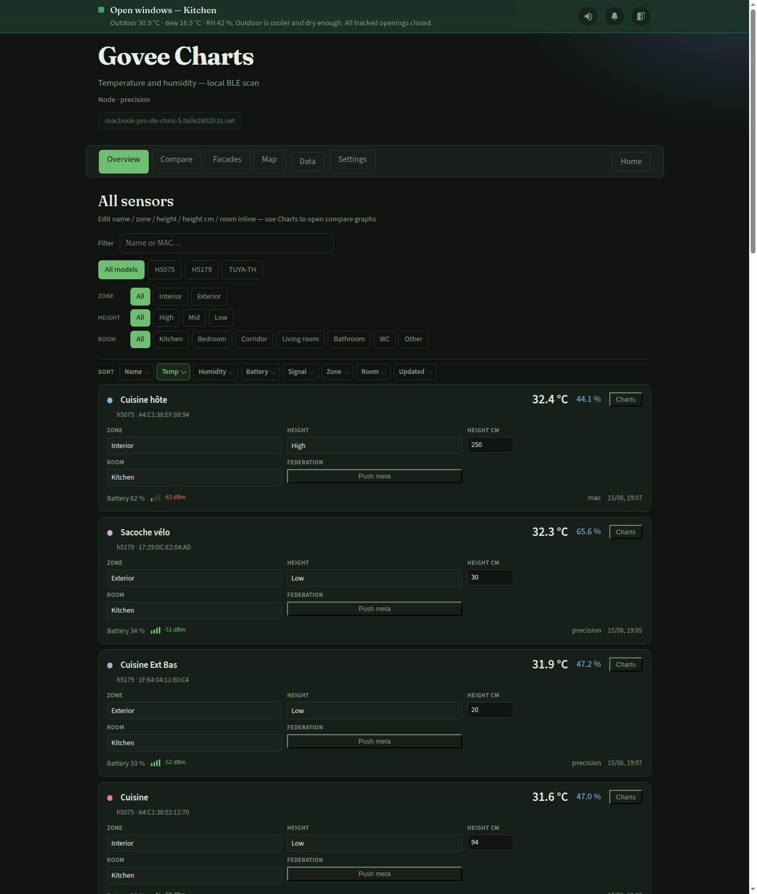
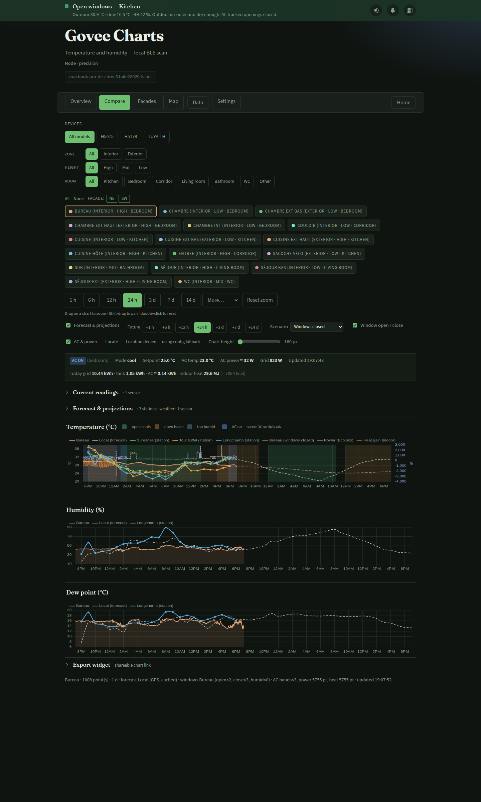
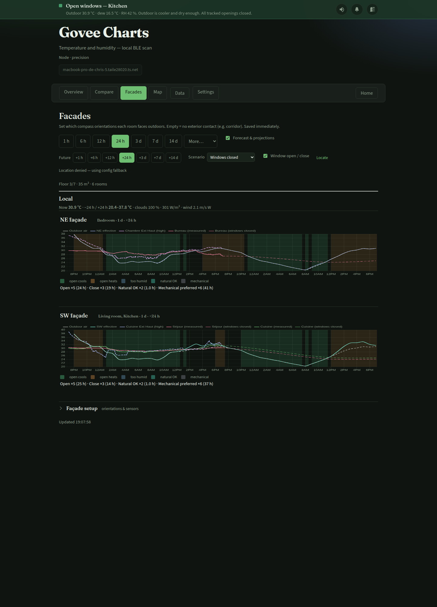
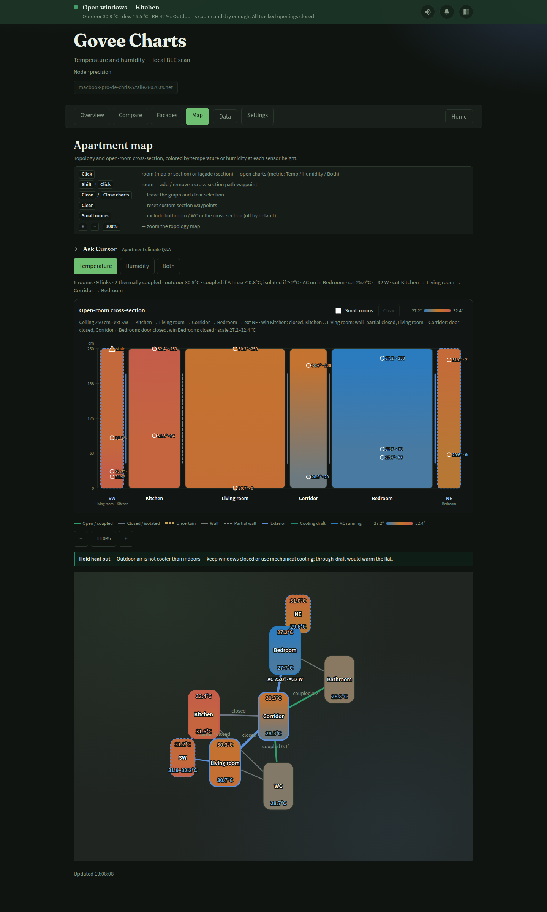
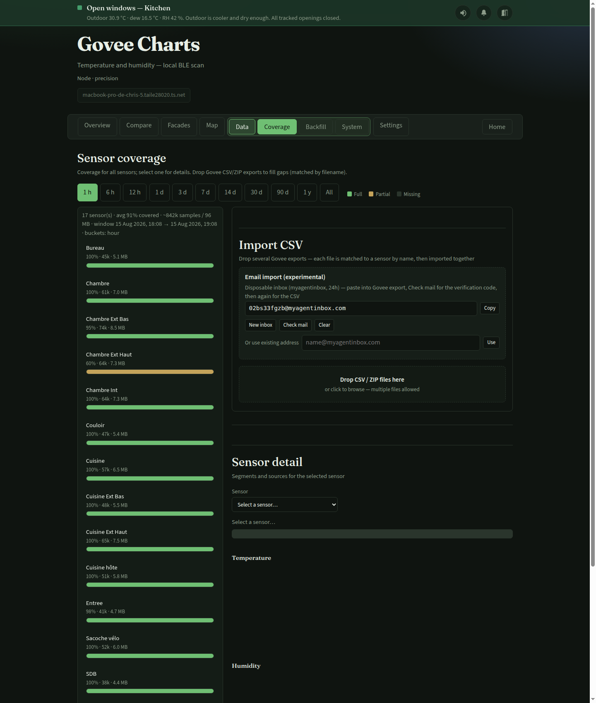
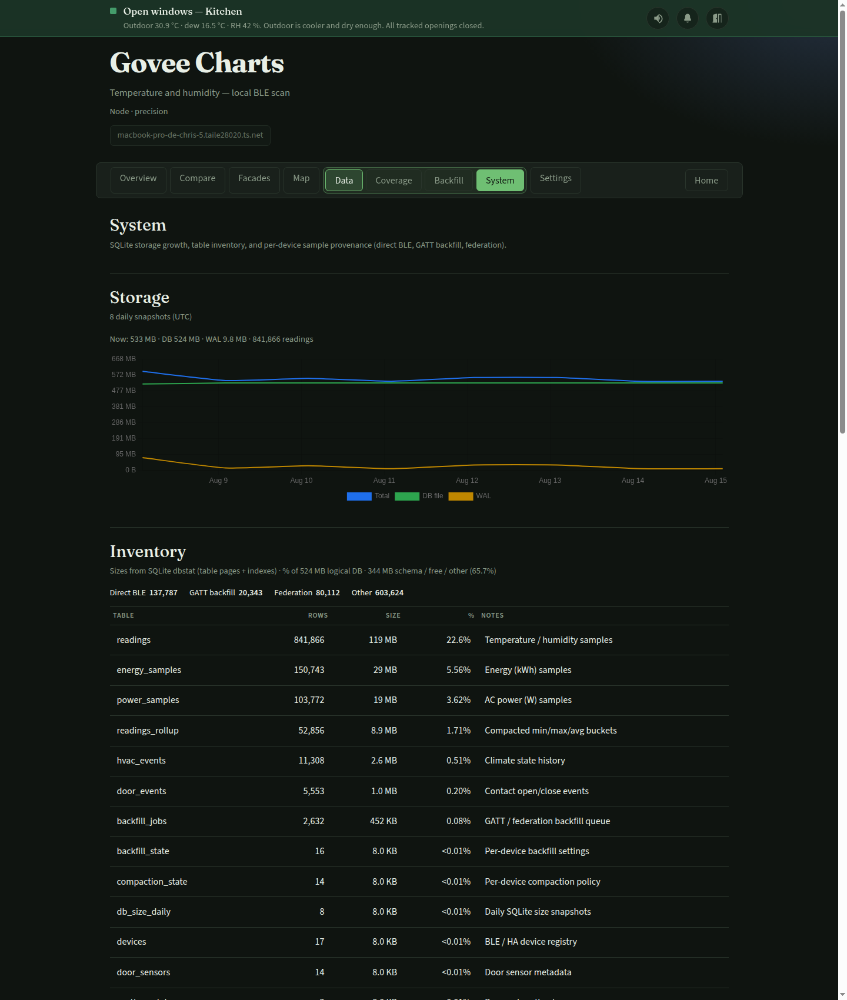

# Govee Charts (BLE)

Collect temperature and humidity from nearby Govee BLE thermometers, store
history in SQLite, and show charts in a local HTML dashboard.

Multiple instances can federate on the LAN: each node scans near itself and
pushes its readings to the others.

## Screenshots

Live captures from a real apartment install (UI in English; device labels may
use any language). Refresh with
`venv/bin/python scripts/capture_readme_screenshots.py` while the UI is running
on `http://127.0.0.1:8080` (needs `websocket-client` in the venv).

### Overview

Sensor list with inline zone / height / room editing, filters, and federation
**Push meta**. The top bar shows window advice (Settings → **Window advice**:
station **v1** or façade **v2** — see [advice models](docs/advice-models.md)).



### Compare

Multi-sensor temperature, humidity, and dew-point charts with forecast
projections, window open/close bands, and optional AC / power overlays.



### Facades

Per-room exterior orientations and façade temperature spread charts driven by
solar / outdoor context.



### Map

Apartment topology and open-room cross-section colored by live temperature (or
humidity) at each sensor height, plus cooling-draft / hold-heat suggestions and
optional **Ask Cursor** Q&A.



### Coverage

History completeness timeline and per-sensor charts; drop Govee CSV/ZIP exports
to fill gaps.



### System

Storage inventory, DB size history, and readings provenance across federation
sources.



## Development chat history

Cursor agent transcripts that shaped this project are exported under
[`docs/chat-history/`](docs/chat-history/README.md) (Markdown index + one file
per conversation). Re-run
`venv/bin/python scripts/export_agent_chat_history.py` to refresh from local
Cursor data. Map **Ask Cursor** threads are separate (`data/map_chat.db`).

## Supported sensors

- **H5075** / H5072 (manufacturer ID `0xEC88`)
- **H5179** (manufacturer ID `0x8801`, or newer firmware with ID `0x0001` /
  broadcast name `GV5179_XXXX` — same packed payload as H5101/H5177)
- **SwitchBot Meter family** (Meter, Meter Plus, Meter Pro, Meter Pro CO2,
  Indoor/Outdoor — manufacturer ID `0x0969` + service `0xFD3D`)

Auto-discovery: any supported device advertising these payloads appears without
manual pairing.

## Requirements

- Python 3.9+ (3.11+ recommended; 3.9–3.10 need `tomli` from requirements)
- Linux Bluetooth adapter (`hci0`) within range of the sensors (unless the node
  is a hub with scanning disabled)
- Optional: second USB dongle (`hci1`) closer to distant sensors
- macOS (development): Bluetooth on, and your terminal app allowed under
  **System Settings → Privacy & Security → Bluetooth**

On Raspberry Pi OS with Python &lt; 3.10, `bleak` 3.x is unavailable; this project
accepts `bleak` 0.22+ on most platforms. On **armv6l** (Pi Zero / early Pi),
requirements pin older `bleak` + pure-Python `dbus-fast` (&lt; 1.18) because newer
`dbus-fast` has no armv6 wheels. On macOS with Python 3.9, PyObjC is capped
below 12.x (12 dropped 3.9 support).

## Install

```bash
cd ~/govee-charts
make install
# optional: edit config.toml (labels, port, retention, federation)
```

## Usage

```bash
make discover   # scan 30s, list detected Govee devices
make run        # collector + web UI
make serve      # web UI only (no BLE scanner)
make workers    # workers only (BLE/backfill/HA/federation)
```

Open [http://127.0.0.1:8080](http://127.0.0.1:8080) (or `https://…` if SSL is enabled).

## HTTPS (self-signed)

HTTP stays on **8080** (federation, old bookmarks). HTTPS listens on **8081**
so geolocation works via `https://192.168.x.x:8081`.

```bash
make ssl                 # generate data/ssl/cert.pem + key.pem (LAN SANs)
# config.toml:
# [server]
# ssl = true
# ssl_port = 8081
make restart             # or make run
```

Open `https://<lan-ip>:8081`, accept the certificate warning once. Regenerate
after a network change with `./scripts/gen-ssl-cert.sh --force`.

If `ssl = true` and certs are missing, the app auto-runs cert generation
(`ssl_auto_generate = true`).

## Run in the background

After `make install` and editing `config.toml`:

### Linux (systemd)

```bash
# Install split services (start on boot)
sudo make systemd-install

# Restart controls
make restart-ui
make restart-workers
make restart-all
```

Services:
- `govee-charts-ui` runs FastAPI/UI only
- `govee-charts-workers` runs BLE scanner, backfill, HA pollers, federation publish

`restart-workers` keeps the UI available while workers restart.

Logs: `journalctl -u govee-charts-ui -u govee-charts-workers -f` and
`govee-charts.log` in the project directory.

Remove: `sudo make systemd-uninstall` (or target only one service with
`sudo ./scripts/install-systemd.sh --target ui uninstall` / `--target workers uninstall`)

Both units use `Restart=always`. Re-install units after pulling this change:
`sudo make systemd-install` (or copy updated units and `daemon-reload`).

On Raspberry Pi, ensure the service user is in the `bluetooth` group:

```bash
sudo usermod -aG bluetooth "$USER"
```

### macOS (launchd)

```bash
# BLE collector + web UI (starts at login, no sudo)
make launchd-install

# Hub only (no local BLE scan)
./scripts/install-launchd.sh --hub install
```

Restart / status / remove:

```bash
make restart
make service-status
make launchd-uninstall
```

Logs: `govee-charts.log` and `govee-charts.launchd.log` in the project directory.

Allow Bluetooth for **Python** under
**System Settings → Privacy & Security → Bluetooth**. A LaunchAgent does not
inherit Cursor/Terminal’s Bluetooth grant — without this toggle, the web UI
stays up but local scanning fails with `BLE is not authorized`. Then:
`make restart`.

## Federation (multiple machines)

On each machine, install the project and cross-link peer URLs in `[federation]`:

```toml
[federation]
node_id = "basement"          # unique per machine
token = "shared-secret"
peers = ["http://192.168.1.10:8080"]   # the other instance
```

On the other node, `peers` points back here. Locally produced samples are
pushed to peers (live ads as `node_id`, GATT history as `node_id/gatt`);
ingested data is not re-forwarded (no loops). For GATT backfill, the node with
the best recent RSSI for a sensor performs the pull; others defer.

Hub without Bluetooth (central UI only):

```toml
[scanner]
enabled = false
```

## Configuration

See `config.example.toml`:

- `scanner.enabled` — enable/disable local BLE scanning
- `scanner.sample_interval` — minimum seconds between stored samples (default 60)
- `scanner.retention_days` — history retention (default 30)
- `scanner.adapters` — BlueZ adapters (`["hci0", "hci1"]`)
- `federation.peers` — URLs of other instances
- `federation.token` — shared secret for `POST /api/ingest`
- `[weather]` — Open-Meteo hourly forecast + sensor projections (`place` or lat/lon)
- `[cursor_chat]` — Map-view chat via local Cursor Agent CLI (`agent login`, ask mode)
- `[labels]` — friendly names keyed by BLE MAC

## Sensor categories

On the **Overview** page, each sensor has an editable **name** (friendly label),
**Zone** (interior/exterior), **Height** (high/mid/low), optional **Height cm**
(exact mounting height above the floor, 0–600), and **Room** (kitchen, bedroom,
corridor, living, other). Names and categories are stored in SQLite (labels also
still work from `config.toml` as fallback). Values can be filtered in Overview
and Compare. On first start, empty categories are inferred from friendly labels
when possible.
When **Height cm** is set, the **Map** view places temperatures on the vertical
band using that height (relative to `apartment.ceiling_m`); otherwise it falls
back to high/mid/low mapped onto the door / transom geometry
(`apartment.door_height_m` ≈ 2.0 m in a 2.5 m storey: high above the lintel,
mid at mid-door, low near the floor).

Enable in `config.toml` (`weather.enabled = true`).

1. **Browser geolocation** (preferred) — Compare view asks for location and
   sends `latitude`/`longitude` to `/api/forecast`. Click **Locate** to refresh.
2. **Config fallback** — optional `place = "City"` or `latitude`/`longitude`.

Geolocation needs a **secure context** (`https://`, or `http://localhost` /
`127.0.0.1`). Enable self-signed TLS (`make ssl` + `server.ssl = true`) for
LAN IPs. Plain `http://192.168.x.x` is usually blocked by browsers.

Forecast responses are cached on disk (`data/weather_cache.json`, default
30 minutes via `cache_seconds`) to limit Open-Meteo calls.

Projected temperatures use a simple **RC thermal model**: the sensor
relaxes toward `weather(t) + Δ` with time constant `τ` fitted from recent
history (Open-Meteo `past_days` + local readings). If history is too short,
the legacy instant offset `sensor = weather + (sensor_now − weather_now)`
is used. Exterior-zone sensors use a short fixed `τ`. Humidity stays on a
constant bias.

### Apartment layout (optional)

Set `[apartment] enabled = true` in `config.toml` (see `config.example.toml`)
to project rooms as a **multi-node RC network**:

- Corridor hub linked to every room (no direct outdoor coupling)
- Kitchen + living: southwest façades; bedroom: northeast
- Façade comparative temperature prefers exterior sensors with **height = high** (e.g. Cuisine / Chambre Ext Haut); falls back to any exterior sensor
- Capacities from floor area × ceiling (`apartment.ceiling_m`, 2.5 m);
  wall/door conductances by edge type (open-door mixing limited to the
  ~2.0 m leaf; transom above the lintel is a ceiling pocket)
- Passive nodes (bathroom, WC) without sensors
- Solar bias from Open-Meteo **shortwave radiation** and **cloud cover**,
  weighted by façade orientation and local hour (SW stronger in afternoon)
- **Open-window projections** track the same façade-effective outdoor
  temperature (`T_meteo + solar bias`) as the Facades view, not raw air;
  closed-building RC still uses meteo outdoor plus a fitted offset
- **Wind** from Open-Meteo (`wind_speed_10m`, `wind_direction_10m`): on the
  Facades view, window open periods are split into **natural OK** (wind hits a
  façade or drives cross-ventilation NE↔SW above ~1.5 m/s) vs **mechanical
  preferred** (calm, parallel wind, or windows should stay closed)


Requires sensors with `room` categories and at least two mapped rooms including
enough coverage to activate the network (falls back to per-sensor RC otherwise).

The **Facades** view edits which compass orientations each room faces outdoors
(saved under `data/apartment_overrides.json`) and shows live solar bias from
shortwave radiation / cloud cover, plus current wind and natural vs mechanical
ventilation hints.

The **Map** view shows an **open-room cross-section** (kitchen → corridor →
bedroom) to scale with the 2.5 m ceiling and ~2.0 m door frames (transom
above the lintel), colored by live temperatures at each sensor `height_cm`,
plus a topology graph of rooms as vertical bands with walls/doors as edges and
cooling-draft suggestions. Draft / hold uses the same v1 or v2 advice model
as the banner ([docs/advice-models.md](docs/advice-models.md)).

Optional **Ask Cursor** (fold above Temperature / Humidity / Both) chats with the
local Cursor Agent CLI in **ask** mode (read-only Q&A about the live apartment
snapshot). The prompt JSON includes the apartment layout (room areas, façades,
ceiling / door heights) plus live sensors — the agent should not open `config.toml`.
Requires `[cursor_chat] enabled = true`, the `agent` binary on PATH
(or `cursor_chat.agent_bin` absolute path for systemd), and `agent login` as the
same user that runs the UI service. Each turn is stored in a separate SQLite DB
(`cursor_chat.db_path`, default `data/map_chat.db`) with the sensor snapshot and
the window-advice banner text at request time. Restart the UI after changing
this config.

On the Compare **Temperature** chart, optional **Window open / close** bands
compare the first selected interior sensor to outdoor air (±0.5 °C): green =
opening would cool **and** outdoor dew point is safely below indoor air
temperature, amber = opening would heat, blue-grey = outdoor is cooler but
too humid (keep closed). Past + projected future.

Toggle via **Forecast & projections** / **Window open / close**. Optional
Optional **Window alerts** uses the browser Notification API (HTTPS or localhost) and
notifies when advice changes per interior room (open / close / too humid),
checked about every 30 s while the page is open. Safari standalone / Home Screen
apps need HTTPS and a service worker (`/sw.js`); enable via the bell after OS
permission is allowed. Settings → **Window notifications** diagnoses permission
issues and offers fixes (reload, test, copy HTTPS link). Soft-reload after
granting permission usually avoids quitting the web app.

Agent playbook for implementing web notifications (Safari PWA quirks): Cursor
skill `web-notifications` (`~/.cursor/skills/web-notifications/`).

### Door / window history

With `[doors] enabled = true`, Govee Charts listens to MQTT contact sensors
(Home Assistant discovery and/or ring-mqtt) and stores **open/closed** events
in SQLite. Optional `ha_db_path` imports existing Home Assistant recorder
history on startup. Contacts that are only in HA (e.g. Tuya door sensors) can
be polled via REST with `ha_entities` + `ha_token_file` (same token as HVAC).
Query via `/api/doors` and `/api/doors/history`.

On the **Overview** page, **Doors & windows** lets you assign each contact a
**kind** (`door` / `window` / `other`) and a **room** (same room taxonomy as
temperature sensors, including bathroom / WC). Name-based inference runs once
when a contact is first seen; edits use `PATCH /api/doors/{sensor_id}`.

### HVAC / power history (AC + Ecojoko)

With `[hvac] enabled = true`, Govee Charts polls the Home Assistant REST API
for a climate entity (e.g. Tuya AC) and a power sensor (e.g. Little Monkey /
Ecojoko realtime watts). Create a **long-lived access token** in HA
(Profile → Security) and set `hvac.ha_token` or `hvac.ha_token_file`.
Set `hvac.room` to the apartment room id that hosts the unit (default
`bedroom`): when the AC is on, the Map badges that room with the
setpoint and an estimated AC draw (whole-home watts minus baseline).

On startup, optional `hvac.ha_db_path` imports existing recorder history.
The Compare **Temperature** chart can overlay **AC on** bands and a secondary
**power (W)** axis (toggle **AC & power**). The status bar shows setpoint,
estimated AC watts, and grid power.

Energy meters are also polled when configured:
- `energy_entity` — whole-home kWh since midnight (e.g. Infocris réseau)
- `water_heater_energy_entity` — cumulative water-heater kWh

From these (plus power during HVAC bands), the UI estimates **today's** grid /
tank / AC kWh and **indoor heat** (MJ / kcal) using configurable fractions:
tank losses stay indoors (`water_heater_indoor_fraction`), other loads mostly
become heat (`other_loads_indoor_fraction`), and cooling extracts
`ac_cop × E_ac` (outdoor compressor — not an indoor gain).

With **AC & power** enabled on Compare, the temperature chart also overlays
instantaneous **heat gain (W)** from `/api/energy/summary` (negative while
cooling extracts heat).

Query via `/api/hvac`, `/api/hvac/history`, `/api/power/history`,
`/api/energy/summary`.

Data © [Open-Meteo](https://open-meteo.com/).

## API

- `GET /api/devices` — known devices + latest reading + categories
- `GET /api/categories` — zone / height / room taxonomy
- `PATCH /api/devices/{address}/categories` — update `{zone,height,height_cm,room,label}`
- `GET /api/history?address=…&hours=24` — time series
- `GET /api/forecast?hours=24&address=…` — outdoor forecast + optional projections
- `GET /api/apartment` — layout, façades, linked sensors, live solar gains (+ `hvac` when enabled)
- `PATCH /api/apartment/rooms/{id}` — update `{exterior:[…]}` orientations
- `GET /api/doors` — latest door/window open/closed state (+ room / kind)
- `PATCH /api/doors/{sensor_id}` — update `{room,kind,name}` for a contact
- `GET /api/doors/history?hours=168&sensor_id=…` — open/close event history
- `GET /api/hvac` — latest climate + power + estimated `ac_watts` + energy/heat summary
- `GET /api/hvac/history?hours=168` — climate events + active bands
- `GET /api/power/history?hours=168` — power samples (W)
- `GET /api/energy/summary` — today's (or `?hours=`) electrical + indoor heat estimate
- `GET /api/backfill` — GATT history backfill queue + selected sensors + last recovered readings / jobs
- `POST /api/backfill/pause` / `resume` / `refresh` — control the backfill worker
- `POST /api/backfill/devices` — opt a sensor in/out and/or toggle GATT (`{address, enabled?, gatt_enabled?}`; persisted even if the worker is offline)
- `POST /api/backfill/import/preview` — parse Govee Home CSV/ZIP and compare to existing readings (form: `address`, `file`, optional `overwrite`); includes would_insert / would_overwrite + sample diffs
- `POST /api/backfill/import` — confirm ingest (same form fields); with `overwrite=true`, updates conflicting minutes
- `POST /api/ingest` — accept peer readings (`X-Govee-Token` header)
- `POST /api/restart?target=ui|workers` — restart UI or workers (when available)
- `GET /widget?metric=temp&addr=…&past=24&future=24&transparent=0|1` — standalone embeddable chart (iframe / share link)
- `GET /api/tts/voices?lang=fr` / `POST /api/tts` — edge-tts voices + MP3 for in-tab voices; voice `home-tts` **emits** to Home TTS edge (`[tts].home_url`) — sinks are Bridge UI Outputs (no browser play)
- `GET /api/map-chat/status` — Cursor Agent CLI readiness for Map chat
- `GET /api/map-chat/sessions` — recent chat sessions (picker)
- `GET /api/map-chat/history` — persisted turns (`session_id`, `include_snapshot`) from `data/map_chat.db`
- `POST /api/map-chat` — SSE ask-mode chat (`{message, session_id?, banner?}`) with live apartment snapshot
- `POST /api/git/pull` — `git pull --ff-only` from the UI (does not restart services)
- `GET /api/mail/inbox` / `POST /api/mail/inbox` / `DELETE /api/mail/inbox` — disposable inbox for Govee CSV email export (myagentinbox, 24h)
- `POST /api/mail/fetch` — poll inbox and return CSV/ZIP attachments (base64) for Coverage import
- `GET /api/health` — health + `node_id` + workers heartbeat availability

## Notes

- Soft-blocked Bluetooth: `rfkill unblock bluetooth`
- No Govee cloud API — BLE only
- Optional history backfill (`[backfill]`) recovers missing minute samples. Opt-in per sensor in the Backfill UI (none selected by default); a per-sensor **GATT** checkbox (default on) allows local BLE history after peer fill — uncheck it for federation-only recovery. Selection stays editable even when the worker is offline. The worker starts with a local BLE scanner **or** with `federation_pull` plus configured peers. One device at a time; lookback up to ~20 days. Prefer sensors with RSSI ≥ `min_rssi` (default −75 dBm) for GATT. With federation, the worker first pulls peer `/api/history` for the gap (`federation_pull`); only remaining holes go to GATT when enabled. Recovered GATT history is shared as `{node_id}/gatt` and the best-RSSI node does the pull.
- Manual **Import CSV** on the Coverage tab accepts Govee Home app exports (`.csv` or `.zip`). Drop several files at once: each is matched to a sensor by filename, analyzed (samples / already present / would insert / would overwrite / zigzag risk), then imported together with checkboxes to exclude files. Optional **Overwrite existing minutes** replaces conflicting `(address, ts)` rows when temp/humidity differ (preview shows sample diffs and max |ΔT|/|ΔH|). Nearby BLE readings at a different timestamp within ±60s that disagree (|ΔT|≥1°C or |ΔH|≥5%) are flagged as zigzag; insert-only is blocked until overwrite is enabled. Imports store samples as `{node_id}/csv` (local only, no federation push). The Coverage view also shows full/partial/missing timelines plus temperature/humidity charts for the selected sensor.
- **Email import (experimental):** Coverage → Import CSV can create a disposable `myagentinbox.com` address (no signup, ~24h TTL). Paste it into Govee Home’s export-to-email, **Check mail** for the verification code (Copy code), confirm in the app, then **Check mail** again for the CSV/ZIP. Govee may reject some disposable domains — if delivery fails, use a normal mailbox and drop the file manually.
